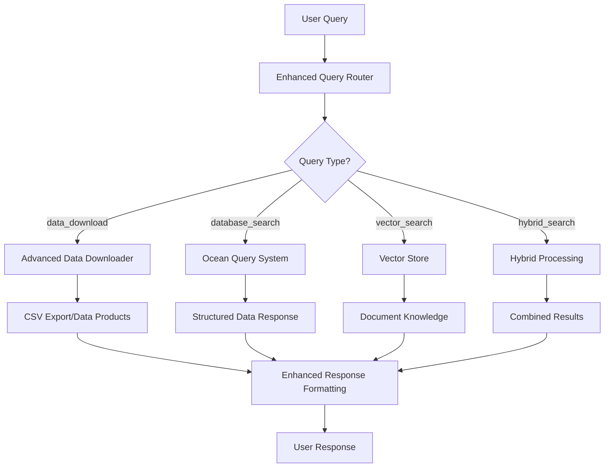

# Sprint 3 Advanced Data Downloading Integration

## 🚀 New Features Added

This integration brings **advanced data downloading capabilities** from Sprint 3 into the main ONC RAG pipeline, providing seamless CSV export, data product discovery, and bulk download functionality.

### ✨ Key Enhancements

1. **Enhanced Query Routing** - Multi-tier classification system
2. **Advanced Data Downloader** - Comprehensive ONC API integration  
3. **CSV Export Capabilities** - Direct data export to spreadsheet formats
4. **Data Product Discovery** - Find available datasets with advanced filtering
5. **Bulk Download Support** - Download multiple files efficiently
6. **Integrated Pipeline** - Seamless integration with existing RAG system

---

## 🎯 Query Routing Improvements

### Classification Hierarchy
The system now uses a **4-tier fallback approach** for query classification:

1. **BERT Model** (`kgosal03/bert-query-classifier`) - Primary classifier
2. **Sprint 3 Sentence Transformer** - Semantic similarity with 5 categories
3. **LLM Classification** (Groq) - Natural language understanding
4. **Keyword-based** - Pattern matching fallback

### New Query Types

| Query Type | Description | Example |
|------------|-------------|---------|
| `data_download` | CSV exports and data downloads | "Download CSV temperature data from CBYIP" |
| `data_discovery` | Find available sensors/devices | "What sensors are at Cambridge Bay?" |
| `general_knowledge` | Conceptual questions | "What is dissolved oxygen?" |
| `data_and_knowledge_query` | Complex analysis queries | "Analyze temperature trends with context" |

---

## 📊 Advanced Data Downloader

### Core Capabilities

#### 1. Data Product Discovery
```python
# Discover available data products
discovery_params = {
    "locationCode": "SEVIP",
    "deviceCategoryCode": "CTD", 
    "extension": "csv"
}
products = downloader.discover_data_products(discovery_params)
```

#### 2. CSV Data Export
```python
# Download CSV data for specific parameters
downloader.download_csv_data(
    location_code="CBYIP",
    device_category="CTD",
    date_from="2023-01-01T00:00:00.000Z",
    date_to="2023-01-02T00:00:00.000Z",
    quality_control=True,
    resample="none"
)
```

#### 3. Bulk Archive Downloads
```python
# Generate URLs for bulk downloads
url_params = {
    "deviceCategoryCode": "HYDROPHONE",
    "locationCode": "SEVIP",
    "dateFrom": "2023-01-01T00:00:00.000Z",
    "dateTo": "2023-01-01T01:00:00.000Z"
}
urls = downloader.bulk_download_archived_files(url_params, generate_urls_only=True)
```

### Supported Parameters

| Parameter | Options | Description |
|-----------|---------|-------------|
| `locationCode` | CBYIP, CBYSS, SEVIP, BACAX | Station locations |
| `deviceCategoryCode` | CTD, HYDROPHONE, ADCP2MHZ | Device types |
| `extension` | csv, mat, png, pdf, txt | File formats |
| `dataProductCode` | TSSD, TSSP, RPSD | Product types |
| `dpo_qualityControl` | 0, 1 | Apply quality control |
| `dpo_resample` | none, average, minMax | Data resampling |

---

## 🔄 Pipeline Integration

### Query Processing Flow



### Integration Points

1. **Query Router** (`src/query_routing/router.py`)
   - Added Sprint 3 Sentence Transformer classifier
   - New DATA_DOWNLOAD query type
   - Multi-tier fallback system

2. **Ocean Query System** (`src/database_search/ocean_query_system.py`)
   - Integrated AdvancedDataDownloader
   - Added data download processing methods
   - CSV export functionality

3. **Main Pipeline** (`src/api/pipeline.py`)
   - Added data download query processing
   - Enhanced response formatting
   - Download result presentation

---

## 🛠️ Usage Examples

### Interactive Mode

```bash
# Start the interactive pipeline
python onc_rag_pipeline_modular.py --docs onc_documents

# Try these new query types:
Ask about ONC data: Download CSV temperature data from CBYIP for last week
Ask about ONC data: What data products are available for hydrophones?
Ask about ONC data: Export CTD data as spreadsheet from Cambridge Bay
```

### Programmatic Usage

```python
from src.api.pipeline import ONCPipeline

# Initialize pipeline
pipeline = ONCPipeline("onc_config.yaml")
pipeline.setup("onc_documents")

# Data download queries
response = pipeline.query("Download CSV temperature data from CBYIP for 2023-01-01")
print(response)

# Device discovery queries  
response = pipeline.query("What sensors are deployed at Cambridge Bay?")
print(response)

# Data product discovery
response = pipeline.query("Show me available CSV files for CTD sensors")
print(response)
```

---

## 📁 File Structure

### New Files Added

```
src/
├── database_search/
│   └── advanced_data_downloader.py    # Sprint 3 integration module
└── query_routing/
    └── router.py                      # Enhanced with Sprint 3 classifier

Data-Engineering/Sprint_3/             # Sprint 3 components
├── Query_Router/
│   ├── Server_Method/                 # FastAPI classifier
│   └── Simple_Python_File_Method/     # Terminal classifier
└── Scripts_OR_API_Calls_Data_Download_Products/
    ├── discover_data_products.py      # Data product discovery
    ├── download_archived_files.py     # Archive downloads
    └── download_data_products.py      # Product downloads

integration_test.py                    # Comprehensive test suite
SPRINT3_FEATURES.md                   # This documentation
```

### Modified Files

- `src/api/pipeline.py` - Added data download processing
- `src/database_search/ocean_query_system.py` - Integrated downloader
- `src/query_routing/router.py` - Enhanced routing with Sprint 3 classifier

---

## 🧪 Testing

### Run Integration Tests

```bash
# Test all new features
python integration_test.py

# Test individual components
python -c "from integration_test import test_query_routing; test_query_routing()"
python -c "from integration_test import test_advanced_data_downloader; test_advanced_data_downloader()"
```

### Expected Test Results

✅ **Query Routing**: Routes data download queries to new DATA_DOWNLOAD type  
✅ **Data Discovery**: Finds available data products with filtering  
✅ **URL Generation**: Creates download URLs for external managers  
✅ **Pipeline Integration**: Processes queries end-to-end  

---

## 🎛️ Configuration

### Environment Variables

```bash
# Required for LLM routing and embeddings
export GROQ_API_KEY="your_groq_api_key"
export MISTRAL_API_KEY="your_mistral_api_key"

# Optional: Custom ONC API token
export ONC_API_TOKEN="your_onc_token"
```

### Configuration Options (`onc_config.yaml`)

```yaml
query_routing:
  use_bert_routing: true        # Primary classifier
  use_sprint3_routing: true     # Sprint 3 fallback  
  use_llm_routing: true         # LLM fallback
  
ocean_responses:
  enhanced_formatting: true     # Natural language responses
  include_educational_context: true
  
# New data download settings
data_downloads:
  default_output_dir: "csv_downloads"
  max_file_size_mb: 100
  quality_control_default: true
```

---

## 🎯 Demo Scenarios

### Scenario 1: CSV Data Export
**Query**: "Download CSV temperature data from CBYIP for January 2023"

**Expected Flow**:
1. Sprint 3 classifier identifies as `data_download_interval`
2. Routes to DATA_DOWNLOAD type
3. Extracts parameters: location=CBYIP, device=CTD, dates=Jan 2023
4. Downloads CSV using AdvancedDataDownloader
5. Returns download summary with file paths

### Scenario 2: Device Discovery
**Query**: "What hydrophones are deployed at Cambridge Bay?"

**Expected Flow**:
1. BERT/Sprint 3 identifies as `data_discovery`
2. Routes to DATABASE_SEARCH with device_discovery parameters
3. Queries ONC API for device information
4. Returns formatted list of hydrophone deployments

### Scenario 3: Data Product Discovery
**Query**: "Show me available data products for temperature sensors"

**Expected Flow**:
1. Classification identifies as `data_discovery`
2. Uses data product discovery APIs
3. Filters by temperature-related parameters
4. Returns comprehensive product catalog

---

## 🚨 Error Handling

The system includes robust error handling:

- **Classification Fallback**: If BERT fails → Sprint 3 → LLM → Keywords
- **API Error Recovery**: Graceful degradation when ONC API is unavailable
- **Download Validation**: Checks file existence and sizes
- **User-Friendly Messages**: Clear error explanations

---

## 🔮 Future Enhancements

### Planned Improvements
1. **Real-time Progress Tracking** for large downloads
2. **Download Queue Management** for batch operations
3. **Data Visualization Integration** with downloaded CSV files
4. **Custom Export Formats** (JSON, Parquet, NetCDF)
5. **Automated Quality Assessment** of downloaded data

### Extension Points
- Custom data processing pipelines
- Integration with external data analysis tools
- Automated report generation from downloaded data
- Machine learning model training on exported datasets

---

## 📞 Support

For questions or issues with the Sprint 3 integration:

1. **Check the integration test**: `python integration_test.py`
2. **Review logs**: Look for routing and download error messages
3. **Verify configuration**: Ensure API keys and tokens are set
4. **Test individual components**: Use the test functions for debugging

---

*This integration successfully combines the robust RAG pipeline with advanced data downloading capabilities, creating a comprehensive system for Ocean Networks Canada data access and analysis.*